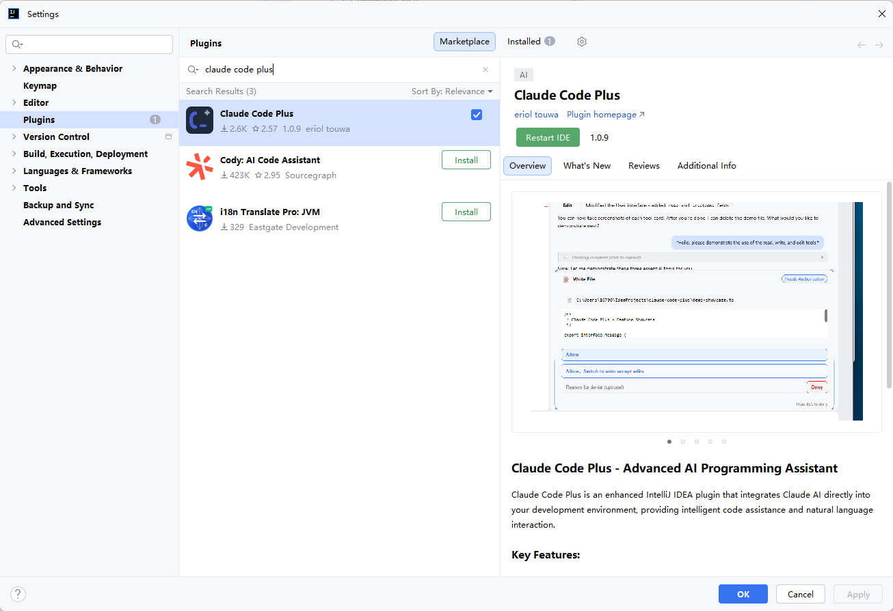
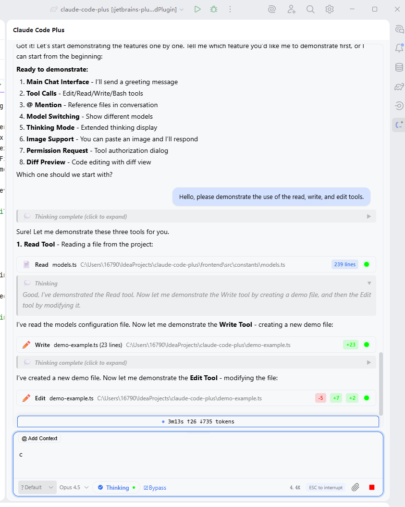
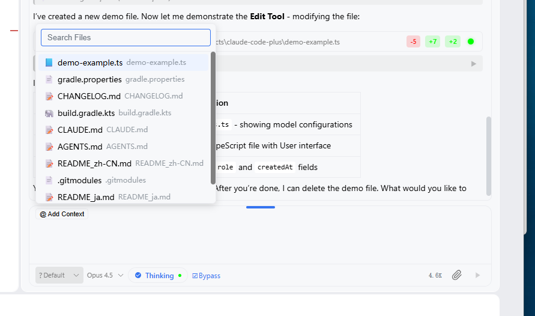
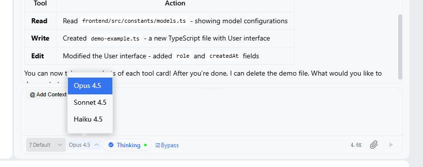
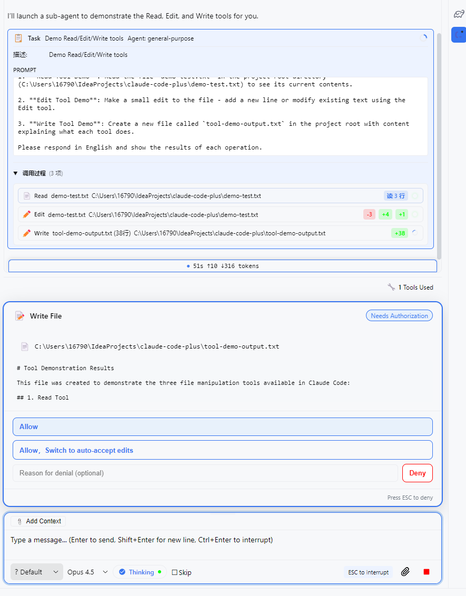
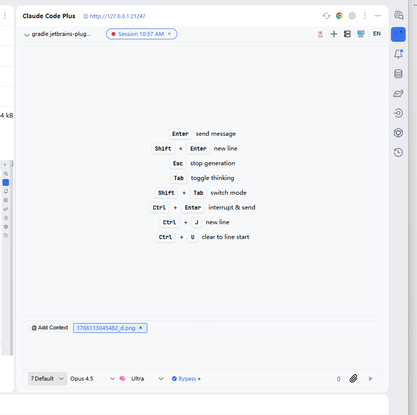
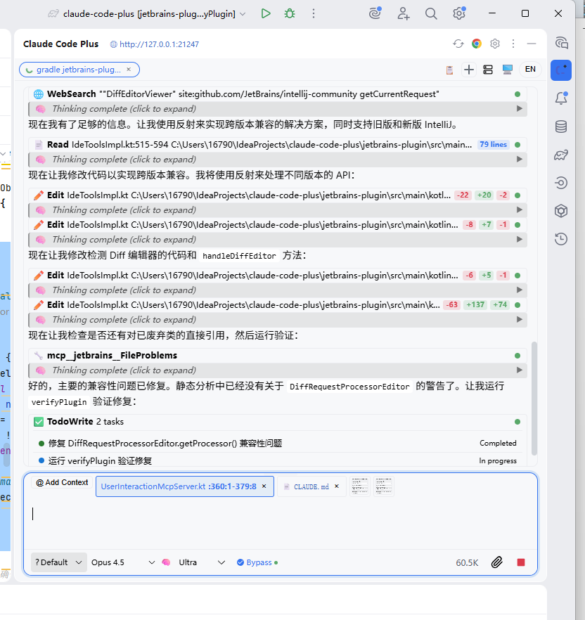
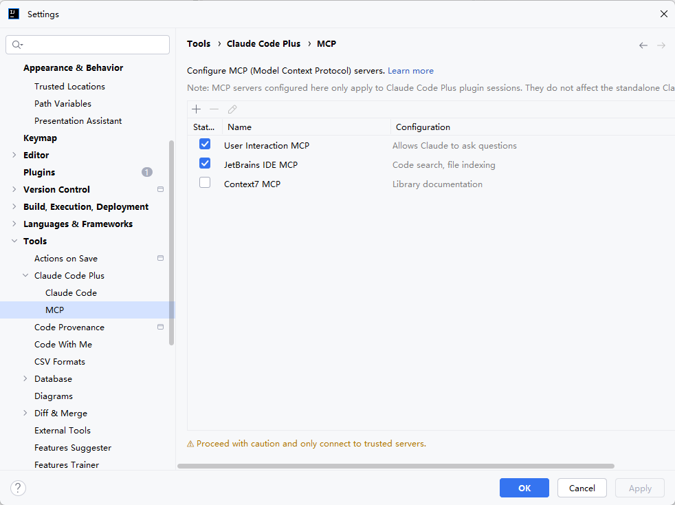

## 这是什么？

**Claude Code Plus** 是一款 IntelliJ IDEA 插件，将 Anthropic 的 [Claude Code](https://docs.anthropic.com/en/docs/claude-code) 直接集成到你的开发环境中。不同于简单的聊天窗口，它能够真正理解你的代码、读写文件、执行命令，成为你的智能编程搭档。

## 核心优势

### 深度 IDE 集成

| 功能 | 说明 |
|------|------|
| **文件操作** | Claude 可以直接读取、创建、编辑项目中的文件 |
| **终端执行** | 执行 shell 命令，运行测试、构建项目 |
| **代码导航** | 点击工具输出中的文件路径，直接跳转到对应位置 |
| **Diff 预览** | 点击编辑卡片，查看代码修改的详细对比 |

### 智能上下文管理

- **@ 文件引用** - 输入 `@` 快速搜索并引用项目文件作为上下文
- **多会话支持** - 同时管理多个独立的对话会话
- **历史记录** - 自动保存对话历史，随时回溯

### 高效交互体验

- **流式响应** - 实时显示 AI 回复，无需等待
- **模型切换** - 一键切换 Opus / Sonnet / Haiku 模型
- **快捷键支持** - `ESC` 中断生成，`Ctrl+J` 快速操作
- **权限控制** - 文件写入等敏感操作需要手动确认

### 原生体验

- 完美适配 IDEA 的亮色/暗色主题
- 工具调用可视化展示（Read/Write/Edit/Bash）
- 支持导出对话为 Markdown/JSON 格式

## 截图预览

### 插件市场

在 JetBrains 插件市场搜索 "Claude Code Plus" 即可找到：



### 工具调用展示

查看 Claude 执行的每一步操作，包括文件读写、代码编辑等：



### @ 文件引用

快速搜索并引用项目中的文件：



### 模型选择器

根据任务复杂度选择合适的模型：



### 权限请求

敏感操作需要用户确认，保障代码安全：



### 用户问题对话框

Claude 可以主动询问你需要的信息，实现更精准的协作：


### 快捷键支持

丰富的快捷键让操作更高效：



### 任务进度视图

实时查看 Claude 的任务执行进度：



### MCP 配置

支持 Model Context Protocol，扩展 Claude 的能力：



## 安装方法

### 方法一：插件市场安装（推荐）

::steps{level="4"}

#### 打开插件设置

- 打开 IntelliJ IDEA
- 进入 **Settings** → **Plugins** → **Marketplace**

#### 搜索插件

在搜索框输入 **"Claude Code Plus"**

#### 安装插件

点击 **Install** 按钮

#### 重启 IDE

安装完成后重启 IDE 即可使用

::

### 方法二：手动安装

::steps{level="4"}

#### 下载插件

前往 [GitHub Releases](https://github.com/touwaeriol/claude-code-plus/releases) 下载最新版本的 `jetbrains-plugin-x.x.x.zip`

#### 打开插件设置

在 IDEA 中：**Settings** → **Plugins** → ⚙️ → **Install Plugin from Disk...**

#### 选择文件

选择下载的 zip 文件

#### 重启 IDE

重启 IDE 完成安装

::

## 环境要求

| 要求 | 说明 |
|------|------|
| **IDE 版本** | IntelliJ IDEA 2024.2 - 2025.3.x |
| **Node.js** | v18 或更高版本（[下载地址](https://nodejs.org/)） |
| **Claude 认证** | 需要完成一次性认证设置 |

### Claude 认证设置

首次使用前，需要在终端完成 Claude 认证：

```bash
npx @anthropic-ai/claude-code
```

按照提示完成登录认证即可。详细说明请参考 [官方文档](https://docs.anthropic.com/en/docs/claude-code/getting-started)。

::alert{type="info"}
**提示**：插件已内置 Claude CLI，无需单独安装！
::

### 使用 API Key（可选）

如果你更喜欢使用自己的 Anthropic API Key，可以通过 [cc-switch](https://github.com/farion1231/cc-switch) 工具配置：

```bash
npx cc-switch
```

## 快速上手

::steps{level="4"}

#### 安装插件

按照上述方法完成插件安装

#### 完成认证

在终端运行 `npx @anthropic-ai/claude-code` 完成认证

#### 打开工具窗口

点击右侧边栏的 **Claude Code Plus** 工具窗口

#### 开始对话

输入你的问题，开始与 Claude 对话！

::

### 使用技巧

| 操作 | 说明 |
|------|------|
| `@文件名` | 引用文件作为上下文 |
| 点击文件路径 | 在编辑器中打开对应文件 |
| 点击工具卡片 | 查看 Diff 预览 |
| `ESC` | 中断 AI 生成 |
| `Enter` | 发送消息 |
| `Shift+Enter` | 输入框内换行 |

## 与 Cursor 内置 AI 对比

| 特性 | Cursor 内置 AI | Claude Code Plus |
|------|----------------|------------------|
| 模型选择 | GPT-4/Claude | Claude 最新模型 |
| IDE 集成 | VS Code 系 | JetBrains 全家桶 |
| 文件操作 | 基础 | 完整读写编辑 |
| 终端执行 | 有限 | 完整支持 |
| 权限控制 | 无 | 敏感操作需确认 |
| Diff 预览 | 无 | 可视化对比 |

## 常见问题

### 问题 1：插件安装后无法启动

确保已安装 Node.js v18 或更高版本，并且 `node` 命令在系统 PATH 中可用。

```bash
# 检查 Node.js 版本
node --version
```

### 问题 2：认证失败

重新运行认证命令：

```bash
npx @anthropic-ai/claude-code
```

按照提示完成登录流程。

### 问题 3：连接超时

检查网络连接，确保能够访问 Anthropic API。如果使用代理，请确保代理配置正确。

## 相关链接

- [JetBrains 插件市场](https://plugins.jetbrains.com/plugin/28343-claude-code-plus)
- [GitHub 仓库](https://github.com/touwaeriol/claude-code-plus)
- [问题反馈](https://github.com/touwaeriol/claude-code-plus/issues)
- [更新日志](https://github.com/touwaeriol/claude-code-plus/releases)

## 总结

Claude Code Plus 将 Claude AI 的强大能力深度集成到 JetBrains IDE 中：

- **真正的 IDE 集成** - 不只是聊天，而是能读写文件、执行命令
- **智能上下文** - @ 引用让 Claude 理解你的项目
- **安全可控** - 敏感操作需要确认，代码安全有保障
- **原生体验** - 完美适配 IDEA 主题和交互习惯

> 💡 **提示**：Claude Code Plus 让 AI 成为你真正的编程搭档，而不只是一个问答机器人。试试让它帮你重构代码、修复 Bug、编写测试，体验前所未有的开发效率提升！
