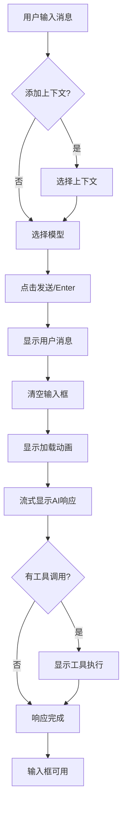
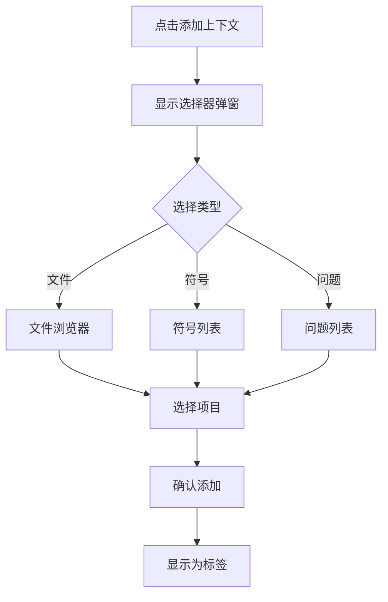
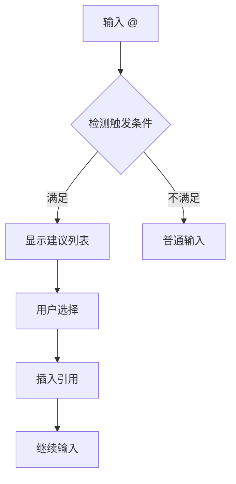

# Claude Code Plus IntelliJ 插件 UI 设计文档

## 1. 概述

本文档定义 Claude Code Plus IntelliJ IDEA 插件的详细 UI 设计规范，包括所有界面组件、交互流程、视觉设计和用户体验要求。

## 2. UI 架构设计

### 2.1 整体布局结构

```
IntelliJ IDEA 窗口
├── 编辑器区域（中央）
├── 项目视图（左侧）
├── Claude Code Plus 工具窗口（右侧）
│   ├── 工具栏
│   ├── 会话管理区
│   ├── 消息显示区
│   ├── 状态栏
│   └── 输入区域
└── 状态栏（底部）
```

### 2.2 工具窗口设计

#### 2.2.1 窗口属性
- **默认位置**: 右侧边栏
- **默认宽度**: 600px (可调整，最小 400px，最大 1200px)
- **图标**: Claude Code Plus 专属图标
- **快捷键**: `Alt+Shift+C` 打开/关闭

#### 2.2.2 窗口模式
- **停靠模式**: 默认停靠在右侧
- **浮动模式**: 支持拖出为独立窗口
- **最小化模式**: 折叠到侧边栏图标
- **全屏模式**: 双击标题栏全屏显示

## 3. 核心组件设计

### 3.1 工具栏设计

```
┌─────────────────────────────────────────────────────────────┐
│ [➕新会话] [📋] [🗑️] [⚙️] │ [🔍搜索...]          [📊] [❓] │
└─────────────────────────────────────────────────────────────┘
```

#### 3.1.1 左侧功能按钮
| 按钮 | 图标 | 功能 | 快捷键 | 提示文本 |
|------|------|------|--------|----------|
| 新会话 | ➕ | 创建新对话 | `Ctrl+N` | "开始新会话" |
| 会话列表 | 📋 | 显示/隐藏会话列表 | `Ctrl+L` | "会话历史" |
| 清空 | 🗑️ | 清空当前会话 | `Ctrl+Shift+D` | "清空对话" |
| 设置 | ⚙️ | 打开设置面板 | `Ctrl+,` | "设置" |

#### 3.1.2 右侧功能区
| 元素 | 功能 | 说明 |
|------|------|------|
| 搜索框 | 全局搜索 | 搜索历史对话内容 |
| 统计图标 | 使用统计 | 显示 Token 使用量 |
| 帮助图标 | 帮助文档 | 打开使用指南 |

### 3.2 会话管理区

#### 3.2.1 会话标签页设计

```
┌─────────────────────────────────────────────────────────────┐
│ [会话1] [会话2 ●] [会话3] [+]                              │
└─────────────────────────────────────────────────────────────┘
```

**标签页特性**:
- 最大显示 8 个标签，超出后显示下拉菜单
- 当前标签高亮显示，带下划线
- 未读消息用红点标记
- 支持拖拽排序
- 右键菜单：重命名、复制、删除、导出

#### 3.2.2 会话列表面板

```
┌─────────────────────────────────────────────────────────────┐
│ 📁 今天                                                     │
│   └─ "重构用户认证模块" (14:30)                            │
│   └─ "修复空指针异常" (10:15)                              │
│ 📁 昨天                                                     │
│   └─ "添加单元测试" (18:45)                                │
│ 📁 本周                                                     │
│   └─ "数据库优化方案" (周一)                               │
└─────────────────────────────────────────────────────────────┘
```

**列表特性**:
- 按时间分组（今天、昨天、本周、更早）
- 显示会话标题和最后活动时间
- 支持搜索和筛选
- 双击打开会话
- 支持批量操作

### 3.3 消息显示区

#### 3.3.1 消息布局设计

```
┌─────────────────────────────────────────────────────────────┐
│ ┌───────────────────────────────────────────────────────┐   │
│ │ 👤 如何优化这段代码的性能？                           │   │
│ │ 📎 UserService.java:45-89                             │   │
│ └───────────────────────────────────────────────────────┘   │
│                                                             │
│ ┌───────────────────────────────────────────────────────┐   │
│ │ 🤖 我看到您的代码有几个可以优化的地方：               │   │
│ │                                                       │   │
│ │ 1. **数据库查询优化**                                │   │
│ │    ```java                                            │   │
│ │    // 优化前                                          │   │
│ │    for (User user : users) {                         │   │
│ │        loadUserDetails(user.getId());                │   │
│ │    }                                                  │   │
│ │    ```                                                │   │
│ │                                                       │   │
│ │ 🔧 正在编辑: UserService.java                        │   │
│ │ [████████░░] 80% 完成                                │   │
│ └───────────────────────────────────────────────────────┘   │
└─────────────────────────────────────────────────────────────┘
```

#### 3.3.2 消息类型设计

**用户消息**:
- 浅色背景（Light: #F5F7FA, Dark: #2B2D30）
- 圆角边框 (8px)
- 内边距 (12px)
- 显示附件和上下文标签

**AI 消息**:
- 无背景色，直接显示在主面板上
- 支持 Markdown 渲染
- 代码块语法高亮
- 表格、列表、链接支持

**系统消息**:
- 居中显示
- 灰色文字
- 用于显示会话开始、结束等信息

#### 3.3.3 工具调用显示

```
┌─────────────────────────────────────────────────────────────┐
│ 🔧 执行工具调用                                             │
│ ├─ Read: "UserService.java" [完成]                         │
│ ├─ Edit: "UserService.java:45" [进行中...]                 │
│ └─ Bash: "mvn test" [等待中]                               │
└─────────────────────────────────────────────────────────────┘
```

**显示规则**:
- 紧凑模式：单行显示工具名和关键参数
- 展开模式：显示完整参数和结果
- 实时状态：等待中、进行中、完成、失败
- 动画效果：跳动点表示进行中

### 3.4 输入区域设计

#### 3.4.1 布局结构

```
┌─────────────────────────────────────────────────────────────┐
│ ┌─────────────────────────────────────────────────────┐   │
│ │ [@file.java] [#bug-fix] [×]                         │   │
│ └─────────────────────────────────────────────────────┘   │
│ ┌─────────────────────────────────────────────────────┐   │
│ │                                                     │   │
│ │ 输入您的问题...                                     │   │
│ │                                                     │   │
│ └─────────────────────────────────────────────────────┘   │
│ ┌─────────────────────────────────────────────────────┐   │
│ │ [📎] [Opus ▼] [权限:绕过▼] [⚡] [15.2k/200k] [↑]   │   │
│ └─────────────────────────────────────────────────────┘   │
└─────────────────────────────────────────────────────────────┘
```

#### 3.4.2 上下文标签区
- 显示已添加的文件、URL、代码片段
- 每个标签可单独删除
- 支持拖拽排序
- 显示文件大小或行数

#### 3.4.3 输入框
- 自动扩展高度（最小 3 行，最大 15 行）
- 支持 Markdown 格式输入
- 支持 @ 内联引用
- 支持代码块输入
- 支持粘贴图片

#### 3.4.4 控制栏
| 控件 | 功能 | 交互设计 |
|------|------|----------|
| 添加上下文 | 打开上下文选择器 | 点击显示弹窗 |
| 模型选择 | 选择 AI 模型 | 下拉菜单 |
| 权限模式 | 选择权限级别 | 下拉菜单 |
| 跳过认证 | 快速执行模式 | 复选框 |
| Token 统计 | 显示使用量 | 悬浮显示详情 |
| 发送按钮 | 发送/停止 | 动态切换 |

### 3.5 状态栏设计

```
┌─────────────────────────────────────────────────────────────┐
│ 会话: opus-20250118-143025 | 消息: 12 | 已用: 45.2k tokens │
└─────────────────────────────────────────────────────────────┘
```

**显示信息**:
- 当前会话 ID
- 消息数量
- Token 使用量
- 连接状态（在线/离线）
- 最后更新时间

## 4. IDE 集成功能

### 4.1 编辑器集成

#### 4.1.1 编辑器右键菜单
```
┌─────────────────────────────────────┐
│ Cut                                 │
│ Copy                                │
│ Paste                               │
│ ─────────────────────────           │
│ 🤖 发送到 Claude                    │
│ 🤖 解释这段代码                     │
│ 🤖 优化这段代码                     │
│ 🤖 生成单元测试                     │
│ 🤖 修复问题                         │
└─────────────────────────────────────┘
```

#### 4.1.2 编辑器装饰器
- 代码行号旁显示 AI 建议图标
- 鼠标悬浮显示 AI 注释
- 高亮显示 AI 修改的代码
- 显示 Diff 对比视图

#### 4.1.3 Quick Fix 集成
```java
public void process(String data) {
    // AI 建议: 添加空值检查
    data.trim(); // ⚠️ 可能的空指针异常
}
```
点击灯泡图标显示 AI 修复建议

### 4.2 项目视图集成

#### 4.2.1 文件右键菜单
- "添加到 Claude 上下文"
- "使用 Claude 分析文件"
- "生成文档注释"
- "查找相似文件"

#### 4.2.2 文件夹右键菜单
- "分析目录结构"
- "生成 README"
- "代码审查"
- "重构建议"

### 4.3 VCS 集成

#### 4.3.1 提交对话框集成
```
┌─────────────────────────────────────────────────────────────┐
│ Commit Message:                                            │
│ ┌─────────────────────────────────────────────────────┐   │
│ │                                                     │   │
│ └─────────────────────────────────────────────────────┘   │
│ [🤖 AI 生成提交信息]                                       │
└─────────────────────────────────────────────────────────────┘
```

#### 4.3.2 Diff 视图集成
- 在 Diff 视图中添加 "AI 解释变更" 按钮
- 显示 AI 对代码变更的分析

### 4.4 调试器集成

#### 4.4.1 变量视图增强
- 右键变量 → "AI 分析值"
- 显示变量状态的 AI 解释

#### 4.4.2 断点增强
- 设置条件断点时的 AI 建议
- 异常断点的 AI 分析

## 5. 上下文选择器

### 5.1 文件选择器

```
┌─────────────────────────────────────────────────────────────┐
│ 🔍 搜索文件...                                    [最近] [全部] │
├─────────────────────────────────────────────────────────────┤
│ 📂 src/main/java                                           │
│   📂 com/example                                           │
│     📄 UserService.java (最近修改)                         │
│     📄 UserController.java                                 │
│   📂 config                                                │
│     📄 AppConfig.java                                      │
├─────────────────────────────────────────────────────────────┤
│ 最近文件:                                                  │
│   📄 UserService.java (5分钟前)                            │
│   📄 application.yml (1小时前)                             │
│   📄 pom.xml (今天)                                        │
├─────────────────────────────────────────────────────────────┤
│ [取消]                                           [添加选中] │
└─────────────────────────────────────────────────────────────┘
```

**功能特性**:
- 树形文件浏览器
- 最近打开文件列表
- 搜索过滤
- 多选支持
- 文件预览
- 智能推荐相关文件

### 5.2 符号选择器

```
┌─────────────────────────────────────────────────────────────┐
│ 🔍 搜索符号...                        [类] [方法] [变量] [全部] │
├─────────────────────────────────────────────────────────────┤
│ 📦 com.example.service                                     │
│   🏛️ UserService                                          │
│     📍 findById(Long): User                               │
│     📍 save(User): void                                    │
│     📍 delete(Long): boolean                              │
│   🏛️ OrderService                                         │
│     📍 createOrder(OrderDTO): Order                       │
├─────────────────────────────────────────────────────────────┤
│ [取消]                                           [添加选中] │
└─────────────────────────────────────────────────────────────┘
```

### 5.3 问题选择器

```
┌─────────────────────────────────────────────────────────────┐
│ 添加代码问题                              [错误] [警告] [全部] │
├─────────────────────────────────────────────────────────────┤
│ ❌ UserService.java:45 - 可能的空指针异常                  │
│ ⚠️ UserController.java:23 - 未使用的导入                   │
│ ❌ OrderService.java:67 - 类型不匹配                       │
├─────────────────────────────────────────────────────────────┤
│ [取消]                                           [添加选中] │
└─────────────────────────────────────────────────────────────┘
```

## 6. 设置面板

### 6.1 设置界面布局

```
┌─────────────────────────────────────────────────────────────┐
│ Claude Code Plus 设置                                      │
├─────────────────────────────────────────────────────────────┤
│ ├─ 常规                                                    │
│ ├─ 模型配置                                                │
│ ├─ 快捷键                                                  │
│ ├─ 外观                                                    │
│ ├─ MCP 服务                                                │
│ └─ 高级                                                    │
├─────────────────────────────────────────────────────────────┤
│ 常规设置:                                                  │
│                                                            │
│ Claude 命令路径: [/usr/local/bin/claude] [浏览...]         │
│                                                            │
│ 默认模型: [Opus ▼]                                         │
│                                                            │
│ 自动保存会话: [✓]                                          │
│                                                            │
│ 会话历史限制: [100] 条                                     │
│                                                            │
│ [恢复默认]                                [应用] [确定]     │
└─────────────────────────────────────────────────────────────┘
```

### 6.2 配置项说明

#### 6.2.1 常规设置
| 配置项 | 类型 | 默认值 | 说明 |
|--------|------|--------|------|
| Claude 命令路径 | 文件路径 | 自动检测 | Claude CLI 位置 |
| 默认模型 | 下拉选择 | Opus | 默认 AI 模型 |
| 自动保存会话 | 复选框 | 启用 | 自动保存对话历史 |
| 会话历史限制 | 数字输入 | 100 | 保存的会话数量 |

#### 6.2.2 模型配置
| 配置项 | 类型 | 默认值 | 说明 |
|--------|------|--------|------|
| Opus Token 限制 | 数字 | 200000 | 最大上下文长度 |
| Sonnet Token 限制 | 数字 | 200000 | 最大上下文长度 |
| 流式响应 | 复选框 | 启用 | 实时显示响应 |
| 超时设置 | 数字 | 60秒 | 请求超时时间 |

#### 6.2.3 外观设置
| 配置项 | 类型 | 默认值 | 说明 |
|--------|------|--------|------|
| 主题跟随 IDE | 复选框 | 启用 | 跟随 IDE 主题 |
| 字体大小 | 滑块 | 14px | 消息字体大小 |
| 代码字体 | 字体选择 | JetBrains Mono | 代码块字体 |
| 显示工具调用 | 复选框 | 启用 | 显示工具调用详情 |

## 7. 交互流程

### 7.1 发送消息流程



### 7.2 上下文添加流程



### 7.3 内联引用流程



## 8. 视觉设计规范

### 8.1 颜色方案

#### 8.1.1 Light 主题
| 元素 | 颜色值 | 用途 |
|------|--------|------|
| 主背景 | #FFFFFF | 面板背景 |
| 次背景 | #F5F7FA | 用户消息背景 |
| 边框 | #E1E4E8 | 分隔线、边框 |
| 主文字 | #24292E | 正文内容 |
| 次文字 | #586069 | 辅助信息 |
| 强调色 | #0366D6 | 链接、按钮 |
| 成功色 | #28A745 | 成功状态 |
| 警告色 | #FFC107 | 警告信息 |
| 错误色 | #DC3545 | 错误信息 |

#### 8.1.2 Dark 主题
| 元素 | 颜色值 | 用途 |
|------|--------|------|
| 主背景 | #1E1E1E | 面板背景 |
| 次背景 | #2B2D30 | 用户消息背景 |
| 边框 | #464647 | 分隔线、边框 |
| 主文字 | #CCCCCC | 正文内容 |
| 次文字 | #969696 | 辅助信息 |
| 强调色 | #4A9EFF | 链接、按钮 |
| 成功色 | #4EC760 | 成功状态 |
| 警告色 | #FFB86C | 警告信息 |
| 错误色 | #FF6B6B | 错误信息 |

### 8.2 字体规范

| 类型 | 字体 | 大小 | 行高 | 用途 |
|------|------|------|------|------|
| 标题 | System | 16px | 1.5 | 面板标题 |
| 正文 | System | 14px | 1.6 | 消息内容 |
| 代码 | JetBrains Mono | 13px | 1.4 | 代码块 |
| 辅助 | System | 12px | 1.5 | 时间戳、提示 |

### 8.3 间距规范

| 类型 | 值 | 用途 |
|------|-----|------|
| 极小 | 4px | 行内元素间距 |
| 小 | 8px | 相关元素间距 |
| 中 | 12px | 组件内边距 |
| 大 | 16px | 组件间距 |
| 极大 | 24px | 区域间距 |

### 8.4 圆角规范

| 类型 | 值 | 用途 |
|------|-----|------|
| 小 | 4px | 按钮、输入框 |
| 中 | 8px | 卡片、消息框 |
| 大 | 12px | 弹窗、面板 |
| 圆形 | 50% | 头像、徽章 |

## 9. 动画和过渡

### 9.1 过渡动画

| 动画类型 | 持续时间 | 缓动函数 | 用途 |
|----------|----------|----------|------|
| 快速 | 150ms | ease-out | 按钮悬浮 |
| 标准 | 200ms | ease-in-out | 面板展开 |
| 慢速 | 300ms | ease-in-out | 页面切换 |

### 9.2 加载动画

**跳动点动画**:
```
● · · → · ● · → · · ● → ● · ·
```
- 每个点 0.4s 周期
- 依次延迟 0.1s

**进度条动画**:
```
[████████░░░░░░░░] 50%
```
- 平滑过渡
- 显示百分比

### 9.3 状态指示器

| 状态 | 动画 | 颜色 | 说明 |
|------|------|------|------|
| 等待中 | 脉冲 | 灰色 | 0.5Hz 脉冲 |
| 进行中 | 旋转 | 蓝色 | 1Hz 旋转 |
| 成功 | 淡入 | 绿色 | 200ms 淡入 |
| 失败 | 抖动 | 红色 | 100ms 抖动 |

## 10. 响应式设计

### 10.1 宽度断点

| 断点 | 最小宽度 | 布局调整 |
|------|----------|----------|
| 紧凑 | 400px | 单列布局，隐藏次要功能 |
| 标准 | 600px | 标准布局，显示所有功能 |
| 宽屏 | 900px | 并排显示更多信息 |
| 超宽 | 1200px | 多列布局，展开所有面板 |

### 10.2 自适应策略

**紧凑模式 (400-600px)**:
- 工具栏图标化
- 折叠会话列表
- 简化输入控制栏
- 单列消息显示

**标准模式 (600-900px)**:
- 完整工具栏
- 标签页显示
- 标准输入区域
- 正常消息布局

**宽屏模式 (900px+)**:
- 展开会话列表
- 并排显示工具结果
- 扩展的输入区域
- 多列信息展示

## 11. 无障碍设计

### 11.1 键盘导航

| 快捷键 | 功能 |
|--------|------|
| Tab | 切换焦点 |
| Shift+Tab | 反向切换 |
| Enter | 确认/发送 |
| Escape | 取消/关闭 |
| Arrow Keys | 列表导航 |
| Ctrl+数字 | 切换标签页 |

### 11.2 屏幕阅读器支持

- 所有交互元素包含 aria-label
- 使用语义化 HTML 标签
- 提供键盘快捷键说明
- 动态内容变化通知

### 11.3 视觉辅助

- 高对比度模式支持
- 焦点高亮显示
- 错误状态多重提示（颜色+图标+文字）
- 可调节字体大小

## 12. 性能优化

### 12.1 渲染优化

- 虚拟滚动（消息列表超过 100 条）
- 懒加载（图片、文件预览）
- 防抖处理（搜索输入）
- 节流处理（滚动事件）

### 12.2 内存管理

- 限制历史消息缓存（最多 1000 条）
- 及时清理 DOM 节点
- 使用对象池复用组件
- 定期垃圾回收

### 12.3 网络优化

- 请求合并和批处理
- 本地缓存策略
- 断线重连机制
- 增量更新

## 13. 错误处理

### 13.1 错误提示设计

```
┌─────────────────────────────────────────────────────────────┐
│ ⚠️ 连接失败                                                │
│ 无法连接到 Claude 服务，请检查网络设置。                    │
│ [重试] [查看详情] [忽略]                                    │
└─────────────────────────────────────────────────────────────┘
```

### 13.2 错误类型

| 错误类型 | 显示方式 | 操作选项 |
|----------|----------|----------|
| 网络错误 | Toast 提示 | 重试、离线模式 |
| 权限错误 | 对话框 | 授权、取消 |
| 数据错误 | 内联提示 | 修正、忽略 |
| 系统错误 | 错误页面 | 重启、报告 |

## 14. 测试要求

### 14.1 UI 测试覆盖

- 所有用户交互路径
- 不同主题切换
- 响应式布局
- 键盘操作
- 错误场景

### 14.2 性能测试

- 大量消息渲染（>1000条）
- 长时间运行稳定性
- 内存泄漏检测
- 响应时间测量

### 14.3 兼容性测试

- IntelliJ IDEA 2022.3+
- 不同操作系统（Windows/Mac/Linux）
- 不同屏幕分辨率
- 不同 DPI 设置

## 15. 实施计划

### 15.1 开发阶段

**阶段 1: 基础框架（Week 1-2）**
- [ ] 工具窗口集成
- [ ] 基础布局实现
- [ ] 主题适配

**阶段 2: 核心功能（Week 3-4）**
- [ ] 消息显示系统
- [ ] 输入区域
- [ ] 会话管理

**阶段 3: IDE 集成（Week 5-6）**
- [ ] 编辑器集成
- [ ] 项目视图集成
- [ ] 快捷键支持

**阶段 4: 高级功能（Week 7-8）**
- [ ] 上下文选择器
- [ ] 设置面板
- [ ] MCP 服务配置

**阶段 5: 优化和测试（Week 9-10）**
- [ ] 性能优化
- [ ] Bug 修复
- [ ] 用户测试

### 15.2 技术栈

- **UI 框架**: Compose for Desktop + Jewel UI
- **状态管理**: Kotlin Coroutines + StateFlow
- **主题系统**: IntelliJ Platform Theme API
- **图标**: IntelliJ Platform Icons
- **构建工具**: Gradle + IntelliJ Platform Plugin

### 15.3 关键依赖

```kotlin
dependencies {
    implementation("org.jetbrains.jewel:jewel-ide-laf-bridge:0.x.x")
    implementation("org.jetbrains.compose.material3:material3:1.x.x")
    implementation("org.jetbrains.kotlinx:kotlinx-coroutines-swing:1.x.x")
    intellijPlatform {
        intellijIdeaCommunity("2025.1")
        bundledPlugin("org.intellij.plugins.markdown")
    }
}
```

## 16. 附录

### 16.1 图标资源

所有图标需要提供以下版本：
- 16x16 (工具栏)
- 20x20 (菜单)
- 32x32 (设置)
- SVG 矢量图 (可缩放)

### 16.2 国际化支持

预留以下语言支持：
- 英语 (en)
- 中文简体 (zh_CN)
- 日语 (ja)
- 韩语 (ko)

### 16.3 遥测和分析

收集以下匿名数据（需用户同意）：
- 功能使用频率
- 错误日志
- 性能指标
- 用户偏好设置