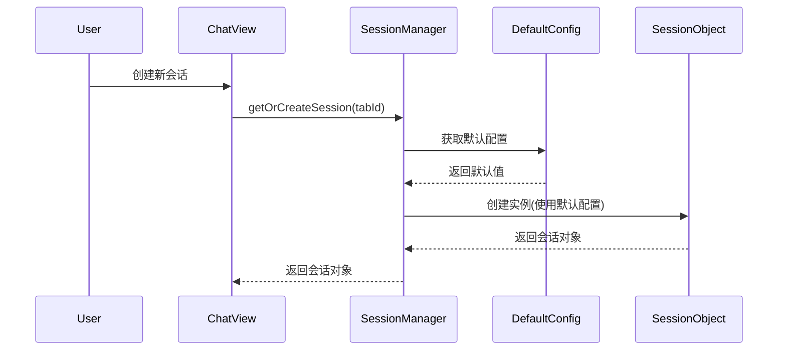
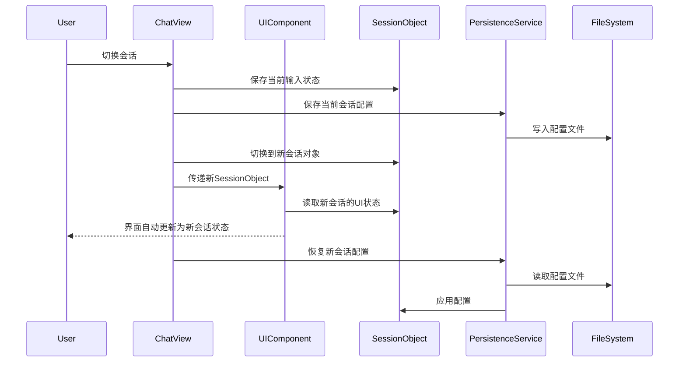
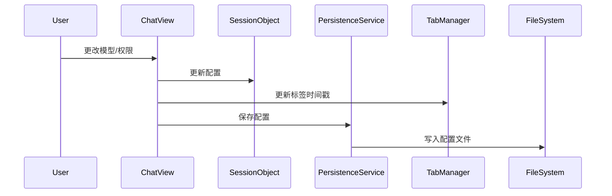

# 会话状态管理系统设计文档

## 概述

Claude Code Plus 的会话状态管理系统实现了完整的多会话并发支持和**无状态UI架构**，每个会话拥有独立的状态、配置和生成任务，UI组件完全无状态，所有状态集中在会话对象中管理。用户可以在多个会话间自由切换而不会相互干扰，且所有UI状态（包括输入框内容、光标位置、上下文选择器状态等）都会完美保持。

## 核心设计理念

1. **状态隔离**：每个会话的所有状态完全独立
2. **无状态UI**：UI组件不保存任何本地状态，完全依赖会话状态
3. **配置持久化**：会话配置自动保存和恢复
4. **并发支持**：支持多个会话同时进行 AI 生成
5. **默认配置**：提供全局默认配置，新会话自动继承
6. **兼容性保障**：支持会话状态为null时的优雅降级

## 系统架构

### 1. SessionObject（会话对象）

位置：`/toolwindow/src/main/kotlin/com/claudecodeplus/ui/models/SessionObject.kt`

**职责**：
- 会话的完整状态容器
- 包含会话的所有运行时数据

**主要属性**：
```kotlin
class SessionObject {
    // 核心会话数据
    var sessionId: String?              // Claude 会话 ID
    var messages: List<EnhancedMessage> // 消息列表
    var contexts: List<ContextReference> // 上下文引用
    
    // 生成状态管理
    var isGenerating: Boolean           // 是否正在生成
    var currentStreamJob: Job?          // 当前生成任务
    var currentProcess: Process?        // 当前运行的进程
    val questionQueue: List<String>     // 问题队列
    
    // 会话配置
    var selectedModel: AiModel          // 选择的 AI 模型
    var selectedPermissionMode: PermissionMode // 权限模式
    var skipPermissions: Boolean        // 是否跳过权限确认
    
    // ========== 完整的 UI 状态管理 ==========
    // 输入框状态
    var inputTextFieldValue: TextFieldValue  // 完整输入框状态（包含光标位置）
    var inputText: String               // 兼容性属性（文本内容）
    var inputResetTrigger: Any?         // 输入重置触发器
    
    // 上下文选择器状态
    var showContextSelector: Boolean    // 上下文选择器是否显示
    var atSymbolPosition: Int?          // @ 符号位置（内联引用）
    
    // 进程管理
    var claudeProcess: Process?         // 当前正在运行的Claude CLI进程
    
    // 状态管理方法
    fun updateInputText(textFieldValue: TextFieldValue)
    fun clearInput()                    // 清空输入框和相关状态
    fun saveInputState(textFieldValue: TextFieldValue)
    fun restoreInputState(): TextFieldValue
}
```

### 2. 无状态UI组件架构

**设计原理**：
- UI组件不使用任何 `mutableStateOf`
- 所有状态读取从 `sessionObject` 获取
- 所有状态更新通过 `sessionObject?.updateXxx()` 方法
- 支持 `sessionObject` 为 null 时的兼容性回退

**示例实现**：
```kotlin
@Composable
fun UnifiedInputArea(
    // ... 其他参数
    sessionObject: SessionObject? = null,  // 会话状态来源
    inputResetTrigger: Any? = null
) {
    // 状态读取：使用会话状态或兼容性默认值
    val showContextSelector = sessionObject?.showContextSelector ?: false
    val atSymbolPosition = sessionObject?.atSymbolPosition
    val textFieldValue = sessionObject?.inputTextFieldValue ?: TextFieldValue("")
    
    ChatInputField(
        value = textFieldValue,
        onValueChange = { 
            // 状态更新：通过会话对象更新
            sessionObject?.updateInputText(it) 
        },
        onSend = {
            if (textFieldValue.text.isNotBlank()) {
                onSend(textFieldValue.text)
                sessionObject?.clearInput()  // 清空输入
            }
        }
    )
}
```

### 3. SessionManager（会话管理器）

位置：`/toolwindow/src/main/kotlin/com/claudecodeplus/ui/services/SessionManager.kt`

**职责**：
- 集中管理所有会话的生命周期
- 提供会话的创建、获取、销毁接口
- 支持会话查询和统计

**核心功能**：
```kotlin
class SessionManager {
    // 获取或创建会话
    fun getOrCreateSession(
        tabId: String,
        initialSessionId: String? = null,
        initialMessages: List<EnhancedMessage> = emptyList(),
        initialModel: AiModel? = null,
        initialPermissionMode: PermissionMode? = null,
        initialSkipPermissions: Boolean? = null
    ): SessionObject
    
    // 会话查询
    fun getGeneratingSessions(): List<Pair<String, SessionObject>>
    fun getSessionsWithQueue(): List<Pair<String, SessionObject>>
    fun getSessionStats(): SessionStats
}
```

### 4. DefaultSessionConfig（默认配置）

位置：`/toolwindow/src/main/kotlin/com/claudecodeplus/ui/services/DefaultSessionConfig.kt`

**职责**：
- 管理全局默认会话配置
- 配置持久化到用户设置
- 为新会话提供默认值

**配置项**：
- 默认 AI 模型
- 默认权限模式
- 默认跳过权限设置

### 5. SessionPersistenceService（持久化服务）

位置：`/toolwindow/src/main/kotlin/com/claudecodeplus/ui/services/SessionPersistenceService.kt`

**职责**：
- 保存会话配置到文件系统
- 从文件恢复会话配置
- 管理配置文件的生命周期

**存储位置**：
- 项目目录下的 `.claude/sessions/` 目录
- 文件格式：`{sessionId}.metadata.json`

## 工作流程

### 1. 新建会话流程



### 2. 会话切换流程（无状态UI）



### 3. 配置更改流程



## 关键特性

### 1. 无状态UI架构

**核心原理**：
- UI组件完全不保存状态，所有状态集中在 `SessionObject` 中
- 状态读取：`sessionObject?.propertyName ?: defaultValue`
- 状态更新：`sessionObject?.updateMethod(newValue)`
- 兼容性处理：支持 `sessionObject` 为 null 时的优雅降级

**优势**：
- **状态一致性**：确保UI显示的状态始终与会话状态同步
- **切换无缝**：会话切换时所有UI状态（输入框内容、光标位置、选择器状态等）完美保持
- **测试友好**：UI组件纯净，状态逻辑易于单元测试
- **内存安全**：避免了状态泄漏和不一致问题

**实现示例**：
```kotlin
@Composable
fun UnifiedChatInput(
    // ... 其他参数
    sessionObject: SessionObject? = null
) {
    // 读取状态：使用会话状态或默认值
    val textFieldValue = sessionObject?.inputTextFieldValue ?: TextFieldValue("")
    val showContextSelector = sessionObject?.showContextSelector ?: false
    
    ChatInputField(
        value = textFieldValue,
        onValueChange = { 
            // 更新状态：通过会话对象
            sessionObject?.updateInputText(it) 
        },
        onShowContextSelector = { position ->
            // 更新状态：通过会话对象
            sessionObject?.let { session ->
                session.showContextSelector = true
                session.atSymbolPosition = position
            }
        }
    )
    
    // 上下文选择器状态完全由会话管理
    if (showContextSelector) {
        ContextSelectorPopup(
            onDismiss = {
                sessionObject?.let { session ->
                    session.showContextSelector = false
                    session.atSymbolPosition = null
                }
            }
        )
    }
}
```

### 2. LaunchedEffect 优化

使用 SessionObject 作为 LaunchedEffect 的 key，避免因内部属性更新而重复触发：

```kotlin
// 使用对象引用而非值
LaunchedEffect(sessionObject) {
    // 初始化逻辑
}

// 而不是
LaunchedEffect(sessionId) {
    // 会因 sessionId 变化而重复触发
}
```

### 2. 并发生成支持

每个会话独立管理生成状态：
- 独立的 `isGenerating` 标志
- 独立的 `currentStreamJob` 任务
- 切换会话不会取消其他会话的生成

### 3. 队列管理

每个会话有独立的问题队列：
- Enter 键：添加到队列
- Alt+Enter：中断并立即发送
- 自动处理：完成后自动处理下一个

### 4. 配置继承机制

```
全局默认配置 (DefaultSessionConfig)
    ↓ 继承
新会话初始配置
    ↓ 用户修改
会话独立配置
    ↓ 持久化
配置文件 (.claude/sessions/)
```

## 使用示例

### 创建会话

```kotlin
val sessionManager = SessionManager()
val session = sessionManager.getOrCreateSession(
    tabId = "tab-123",
    initialModel = AiModel.OPUS  // 可选，默认使用全局配置
)
```

### 无状态UI组件使用

```kotlin
@Composable
fun ChatView(sessionObject: SessionObject) {
    Column {
        // 消息列表 - 从会话状态读取
        LazyColumn {
            items(sessionObject.messages) { message ->
                MessageDisplay(message = message)
            }
        }
        
        // 输入区域 - 传递会话对象，实现无状态
        UnifiedInputArea(
            contexts = sessionObject.contexts,
            selectedModel = sessionObject.selectedModel,
            selectedPermissionMode = sessionObject.selectedPermissionMode,
            skipPermissions = sessionObject.skipPermissions,
            isGenerating = sessionObject.isGenerating,
            sessionObject = sessionObject,  // 关键：传递会话对象
            inputResetTrigger = sessionObject.inputResetTrigger,
            onSend = { text ->
                // 发送消息逻辑
                sendMessage(text, sessionObject)
            }
        )
    }
}
```

### 切换会话时保存状态

```kotlin
// 自动在 ChatView 中处理
LaunchedEffect(sessionId) {
    if (sessionId != currentId) {
        // 保存当前会话配置
        SessionPersistenceService.saveSessionMetadata(
            currentId, sessionObject, workingDirectory
        )
        // 恢复新会话配置
        SessionPersistenceService.restoreSessionConfig(
            sessionId, sessionObject, workingDirectory
        )
    }
}
```

### 状态更新最佳实践

```kotlin
// ✅ 正确：通过会话对象更新状态
onModelChange = { model ->
    sessionObject.selectedModel = model
    // 自动保存到文件
    SessionPersistenceService.saveSessionMetadata(...)
}

// ✅ 正确：更新输入框状态（保持光标位置）
onInputChange = { textFieldValue ->
    sessionObject.updateInputText(textFieldValue)
}

// ✅ 正确：清空输入框（同时清理相关状态）
onSend = { text ->
    sendMessage(text)
    sessionObject.clearInput()  // 清空输入框和相关UI状态
}

// ❌ 错误：UI组件不应该有本地状态
@Composable
fun BadInputComponent() {
    var localText by remember { mutableStateOf("") }  // ❌ 不要这样做
    // ...
}
```

### 兼容性处理示例

```kotlin
@Composable
fun CompatibleInputArea(
    sessionObject: SessionObject? = null  // 可能为null
) {
    // 兼容性读取：提供默认值
    val textValue = sessionObject?.inputTextFieldValue ?: TextFieldValue("")
    val isGenerating = sessionObject?.isGenerating ?: false
    
    ChatInputField(
        value = textValue,
        enabled = !isGenerating,
        onValueChange = { newValue ->
            // 兼容性更新：安全调用
            sessionObject?.updateInputText(newValue)
        }
    )
}
```

## 文件结构

```
project-root/
├── .claude/
│   └── sessions/
│       ├── {sessionId1}.metadata.json
│       ├── {sessionId2}.metadata.json
│       └── ...
└── ...
```

## 元数据格式

```json
{
  "modelName": "OPUS",
  "permissionMode": "BYPASS_PERMISSIONS",
  "skipPermissions": true,
  "customSystemPrompt": null,
  "createdWithVersion": "1.0.0",
  "additionalSettings": {}
}
```

## 优势

1. **用户体验**：
   - **完美会话切换**：所有UI状态（输入框内容、光标位置、上下文选择器状态等）在会话切换时完美保持
   - **真正的多会话并发**：每个会话完全独立，可同时进行AI对话而不相互干扰
   - **配置持久化**：重启应用后能恢复每个会话的详细状态和配置
   - **无状态响应**：UI响应更快，无需等待状态同步

2. **技术实现**：
   - **无状态UI架构**：UI组件完全纯净，无本地状态，易于测试和维护
   - **状态一致性**：单一数据源确保UI显示与实际状态完全同步
   - **内存安全**：避免状态泄漏、不一致和竞态条件
   - **避免 LaunchedEffect 重复触发**：使用对象引用作为key
   - **兼容性保障**：优雅处理会话状态为null的情况

3. **开发体验**：
   - **组件复用性**：无状态组件可在任何上下文中复用
   - **测试友好**：状态逻辑与UI分离，单元测试简单
   - **调试容易**：所有状态集中管理，问题定位快速
   - **扩展便利**：新增UI状态只需修改SessionObject

4. **可扩展性**：
   - **轻松添加新的会话级配置**：只需在SessionObject中添加属性
   - **支持未来的会话导入/导出功能**：完整的状态序列化
   - **为团队协作功能预留空间**：会话状态可以在用户间共享
   - **插件化友好**：第三方插件可以扩展会话状态

## 未来改进

1. **会话模板**：预定义的会话配置模板
2. **会话分享**：导出/导入会话配置
3. **会话统计**：使用频率、token 消耗等
4. **会话搜索**：基于配置或内容搜索会话