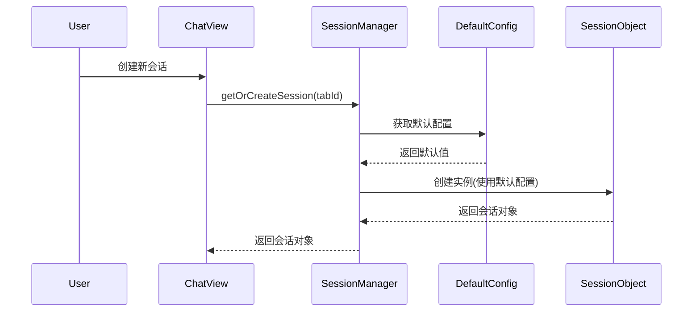
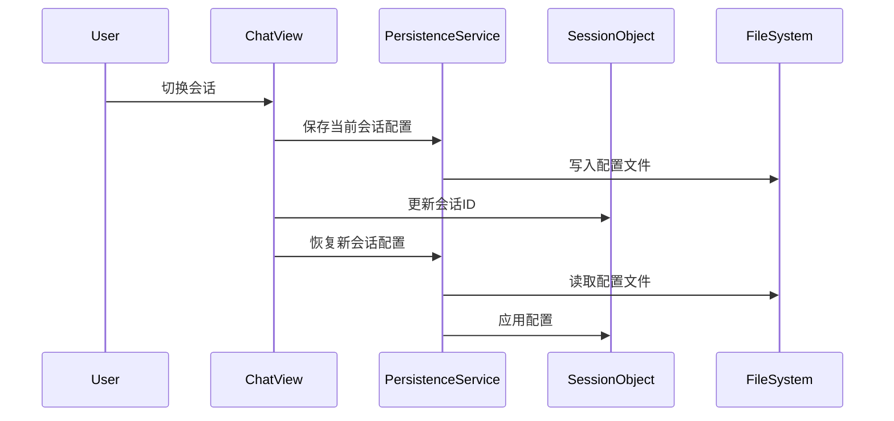
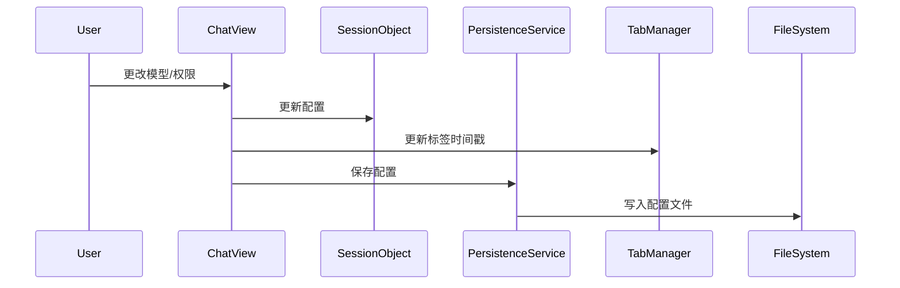

# 会话状态管理系统设计文档

## 概述

Claude Code Plus 的会话状态管理系统实现了完整的多会话并发支持，每个会话拥有独立的状态、配置和生成任务，用户可以在多个会话间自由切换而不会相互干扰。

## 核心设计理念

1. **状态隔离**：每个会话的所有状态完全独立
2. **配置持久化**：会话配置自动保存和恢复
3. **并发支持**：支持多个会话同时进行 AI 生成
4. **默认配置**：提供全局默认配置，新会话自动继承

## 系统架构

### 1. SessionObject（会话对象）

位置：`/toolwindow/src/main/kotlin/com/claudecodeplus/ui/models/SessionObject.kt`

**职责**：
- 会话的完整状态容器
- 包含会话的所有运行时数据

**主要属性**：
```kotlin
class SessionObject {
    // 核心会话数据
    var sessionId: String?              // Claude 会话 ID
    var messages: List<EnhancedMessage> // 消息列表
    var contexts: List<ContextReference> // 上下文引用
    
    // 生成状态管理
    var isGenerating: Boolean           // 是否正在生成
    var currentStreamJob: Job?          // 当前生成任务
    val questionQueue: List<String>     // 问题队列
    
    // 会话配置
    var selectedModel: AiModel          // 选择的 AI 模型
    var selectedPermissionMode: PermissionMode // 权限模式
    var skipPermissions: Boolean        // 是否跳过权限确认
    
    // UI 状态
    var inputText: String               // 输入框内容（切换时保存）
    var inputResetTrigger: Any?         // 输入重置触发器
}
```

### 2. SessionManager（会话管理器）

位置：`/toolwindow/src/main/kotlin/com/claudecodeplus/ui/services/SessionManager.kt`

**职责**：
- 集中管理所有会话的生命周期
- 提供会话的创建、获取、销毁接口
- 支持会话查询和统计

**核心功能**：
```kotlin
class SessionManager {
    // 获取或创建会话
    fun getOrCreateSession(
        tabId: String,
        initialSessionId: String? = null,
        initialMessages: List<EnhancedMessage> = emptyList(),
        initialModel: AiModel? = null,
        initialPermissionMode: PermissionMode? = null,
        initialSkipPermissions: Boolean? = null
    ): SessionObject
    
    // 会话查询
    fun getGeneratingSessions(): List<Pair<String, SessionObject>>
    fun getSessionsWithQueue(): List<Pair<String, SessionObject>>
    fun getSessionStats(): SessionStats
}
```

### 3. DefaultSessionConfig（默认配置）

位置：`/toolwindow/src/main/kotlin/com/claudecodeplus/ui/services/DefaultSessionConfig.kt`

**职责**：
- 管理全局默认会话配置
- 配置持久化到用户设置
- 为新会话提供默认值

**配置项**：
- 默认 AI 模型
- 默认权限模式
- 默认跳过权限设置

### 4. SessionPersistenceService（持久化服务）

位置：`/toolwindow/src/main/kotlin/com/claudecodeplus/ui/services/SessionPersistenceService.kt`

**职责**：
- 保存会话配置到文件系统
- 从文件恢复会话配置
- 管理配置文件的生命周期

**存储位置**：
- 项目目录下的 `.claude/sessions/` 目录
- 文件格式：`{sessionId}.metadata.json`

## 工作流程

### 1. 新建会话流程



### 2. 会话切换流程



### 3. 配置更改流程



## 关键特性

### 1. LaunchedEffect 优化

使用 SessionObject 作为 LaunchedEffect 的 key，避免因内部属性更新而重复触发：

```kotlin
// 使用对象引用而非值
LaunchedEffect(sessionObject) {
    // 初始化逻辑
}

// 而不是
LaunchedEffect(sessionId) {
    // 会因 sessionId 变化而重复触发
}
```

### 2. 并发生成支持

每个会话独立管理生成状态：
- 独立的 `isGenerating` 标志
- 独立的 `currentStreamJob` 任务
- 切换会话不会取消其他会话的生成

### 3. 队列管理

每个会话有独立的问题队列：
- Enter 键：添加到队列
- Alt+Enter：中断并立即发送
- 自动处理：完成后自动处理下一个

### 4. 配置继承机制

```
全局默认配置 (DefaultSessionConfig)
    ↓ 继承
新会话初始配置
    ↓ 用户修改
会话独立配置
    ↓ 持久化
配置文件 (.claude/sessions/)
```

## 使用示例

### 创建会话

```kotlin
val sessionManager = SessionManager()
val session = sessionManager.getOrCreateSession(
    tabId = "tab-123",
    initialModel = AiModel.OPUS  // 可选，默认使用全局配置
)
```

### 切换会话时保存状态

```kotlin
// 自动在 ChatView 中处理
LaunchedEffect(sessionId) {
    if (sessionId != currentId) {
        // 保存当前会话配置
        SessionPersistenceService.saveSessionMetadata(
            currentId, sessionObject, workingDirectory
        )
        // 恢复新会话配置
        SessionPersistenceService.restoreSessionConfig(
            sessionId, sessionObject, workingDirectory
        )
    }
}
```

### 更新配置

```kotlin
// 用户更改模型
onModelChange = { model ->
    sessionObject.selectedModel = model
    // 自动保存到文件
    SessionPersistenceService.saveSessionMetadata(...)
}
```

## 文件结构

```
project-root/
├── .claude/
│   └── sessions/
│       ├── {sessionId1}.metadata.json
│       ├── {sessionId2}.metadata.json
│       └── ...
└── ...
```

## 元数据格式

```json
{
  "modelName": "OPUS",
  "permissionMode": "BYPASS_PERMISSIONS",
  "skipPermissions": true,
  "customSystemPrompt": null,
  "createdWithVersion": "1.0.0",
  "additionalSettings": {}
}
```

## 优势

1. **用户体验**：
   - 切换会话无缝衔接
   - 每个会话保持独立的工作状态
   - 重启应用后能恢复之前的配置

2. **技术实现**：
   - 避免了 LaunchedEffect 重复触发问题
   - 支持真正的多会话并发
   - 配置管理清晰，易于扩展

3. **可扩展性**：
   - 轻松添加新的会话级配置
   - 支持未来的会话导入/导出功能
   - 为团队协作功能预留空间

## 未来改进

1. **会话模板**：预定义的会话配置模板
2. **会话分享**：导出/导入会话配置
3. **会话统计**：使用频率、token 消耗等
4. **会话搜索**：基于配置或内容搜索会话